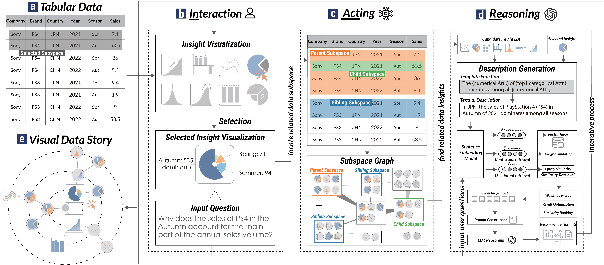

# InReAcTable: LLM-Powered Interactive Visual Data Story Construction from Tabular Data
Insights in tabular data capture valuable patterns that help analysts understand critical information. Organizing related insights into visual data stories is crucial for in-depth analysis. However, constructing such stories is challenging because of the complexity of the inherent relations between extracted insights. Users face difficulty sifting through a vast number of discrete insights to integrate specific ones into a unified narrative that meets their analytical goals. Existing methods either heavily rely on user expertise, making the process inefficient, or employ automated approaches that cannot fully capture their evolving goals. In this paper, we introduce InReAcTable, a framework that enhances visual data story construction by establishing both structural and semantic connections between data insights. Each user interaction triggers the Acting module, which utilizes an insight graph for structural filtering to narrow the search space, followed by the Reasoning module using the retrieval-augmented generation method based on large language models for semantic filtering, ultimately providing insight recommendations aligned with the user’s analytical intent. Based on the InReAcTable framework, we develop an interactive prototype system that guides users to construct visual data stories aligned with their analytical requirements. We conducted a case study and a user experiment to demonstrate the utility and effectiveness of the InReAcTable framework and the prototype system for interactively building visual data stories.

## InReAcTable prototype system
The InReAcTable prototype system assists users in visual data story construction for tabular data. The user interface of InReAcTable system consists of three interconnected panels: the data subspace selection panel, the iterative exploration panel, and the insight information panel. In (a) data subspace selection panel, users can determine a specific data subspace by filtering attribute values in (a1), and all insights in this subspace will be displayed in the (a2) candidate insights panel. The (b) iterative exploration panel uses a circular force-directed layout diagram to map nodes and edges in the exploration path tree. Users interactively explore data through this interface. The insight information panel consists of the (c) insight detail view, presenting detailed information about the focused data insights and supporting users in modifying the exploration path, as well as the (d) exploration history view, enabling users to retrace their steps.

After uploading a tabular dataset, InReAcTable initially partitions the table into subspaces and performs insight extraction. In the data subspace selection panel (a), users can determine a specific data subspace by filtering attribute values (a1) and extract the underlying insights (a2).

The system displays highly significant insights in the first layer of the radial insight tree in the iterative exploration panel (b) to inspire user exploration. The system provides collapsed and expanded states for the insights in the radial insight tree. All newly added nodes are in the collapsed state, and the corresponding data insight types, such as trend and outlier, are mapped with icons to realize efficient use of screen space. When the user clicks on a collapsed node, the node will expand into a rectangular card, showing a detailed visualization of the corresponding insight.

In the expanded state, the InReAcTable system provides three operations for insights: pin, query, and collapse. The pin operation detaches the node from the force-directed graph layout, allowing its position to be changed only by user drag-and-drop interaction, with a shadow effect on the border indicating this fixed state. The query operation sets the target as the current focused node and enables users to input questions in textual format. The collapse operation changes the expanded insight chart to its collapsed state. Due to space constraints, users can interactively view underlying data by hovering over the insight chart or switching to the focused state to view detailed information in the insight information panel.

For insights of interest, users can view detailed information and trace their historical analysis paths in the insight information panel, particularly when users need to revisit or compare previously explored insights.
In addition, users are allowed to interactively modify the data story by rearranging branches in the radial insight tree, thereby integrating multiple insights into a coherent analytical narrative. During this process, users can pose natural language questions in the query box and get recommended insights in the next layer of the radial insight graph under the guidance of the Action and Reasoning module, thereby iteratively constructing visual data stories.

## How to run the InReAcTable prototype system?
To build and run this project on your own, you need to run the back-end and the front-end simultaneously.

- **Backend**
  1. Go to the back-end folder `cd backend`
  2. Install the python dependency `pip install -r requirements.txt`
  3. Run the server `python main.py`
- **Frontend**
  1. Change to the front-end folder `cd frontend`
  2. Project setup `npm install`
  3. Compiles and hot-reloads for development `npm run dev`

Open your browser and go to http://localhost:5173/. Now you can use InReAcTable to construct data stories from tabular data interactively.
